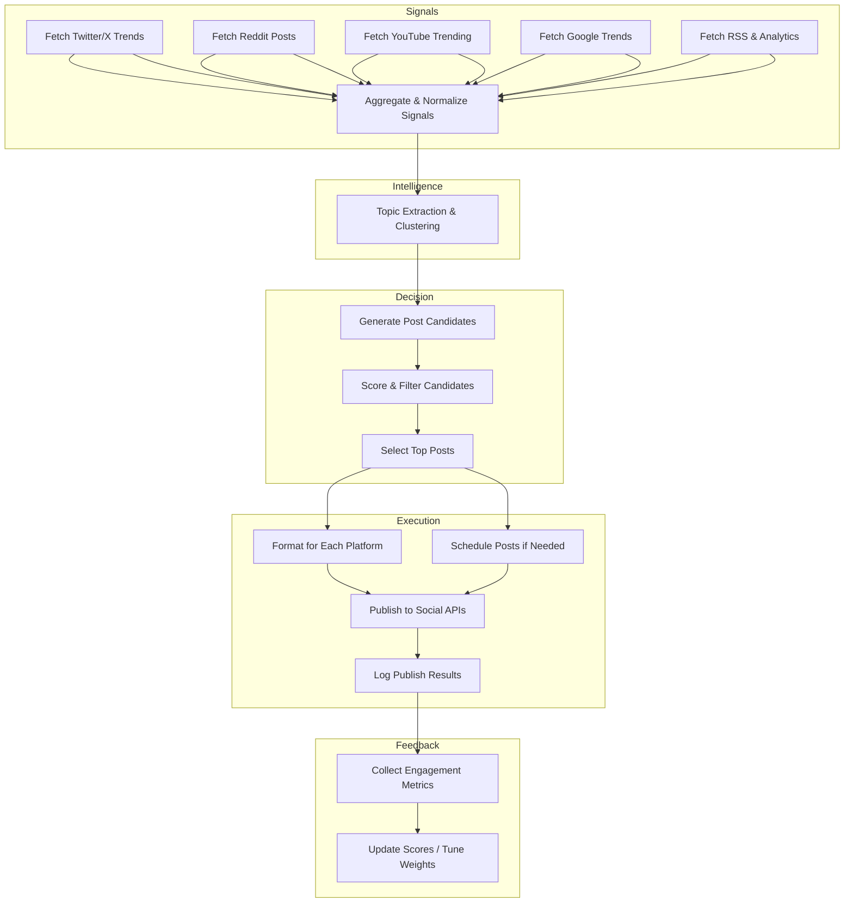
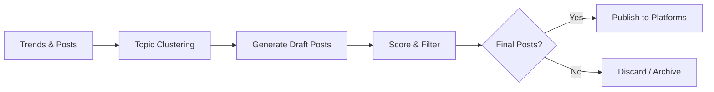

# Autonomous Social Media Posting Skill – Design and Implementation  

**Executive Summary:** This report outlines a production-ready design for a single CLI-based *social media poster* SKILL that autonomously identifies trending topics, generates candidate posts, and publishes them on multiple platforms as the user. The pipeline is organized into five stages: Signal Collection → Intelligence (analysis) → Decision (generate/score) → Execution (publish) → Feedback (metrics). It integrates data from social APIs (Twitter/X, Reddit, YouTube, LinkedIn, Google Trends), RSS feeds and site analytics. Key components include topic clustering (e.g. SBERT embeddings + GMM) to find hot topics【17†L111-L119】, a scoring formula with tunable weights, and a rule engine for brand-safety. The SKILL is defined by a `SKILL.md` manifest (commands, config, auth)【3†L156-L164】 and scripts in logical folders. Example JSON schemas and CLI commands illustrate data interchange. Evaluation uses A/B testing to refine content selection【30†L109-L118】. Robustness is ensured via logging, idempotent operations, retries/backoff on 429 rate-limit errors【14†L785-L789】, and unit/integration tests. Deployment can use cron or queued jobs, with environment-based secrets for API credentials. We provide tables (e.g. data sources vs trade-offs) and Mermaid diagrams for the high-level architecture and decision flow.

## Goals and Scope  
The **goals** of the SKILL are:  
- **Autonomy:** Automatically detect relevant trending topics and publish posts “as me” without manual content curation.  
- **Multi-Platform Coverage:** Support major social channels (Twitter/X, Facebook/LinkedIn, etc.) and integrate site content (RSS, analytics).  
- **Brand Consistency:** Maintain the user’s brand voice and guidelines in all posts, enforcing brand-safety rules (no off-brand or unsafe content).  
- **Data-Driven:** Use real-time and historical signals (social feeds, trends, web analytics) to choose content with the highest engagement potential.  
- **Production-Ready:** Include error handling, logging, scheduling, and a feedback loop (tracking post performance to refine future choices).  

These objectives align with best practices for social media automation, which emphasize stable APIs for “permitted, real-time data” and rigorous content filtering【39†L151-L159】【52†L153-L162】.  

## High-Level Architecture  



**Figure:** *Pipeline Architecture for the Social Media Poster SKILL.* Signals are gathered (Twitter/X, Reddit, Google Trends, site RSS/analytics, etc.) and fed into analysis (topic clustering). The decision stage generates, scores and filters posts. The execution stage formats and publishes content, while the feedback stage gathers post-metrics to adjust future decisions【52†L153-L162】【39†L151-L159】.  

The pipeline roughly follows the “signal→intelligence→decision→execution→feedback” pattern. Notably, Omri Mendels et al. describe a similar trending-topic pipeline where text items are topic-extracted and their occurrence over time forms a time series to detect anomalies【52†L165-L172】. In our case, each pipeline block is implemented as a CLI script (or set of scripts) under a common SKILL directory (see *File Layout* below).

## Folder/File Layout  

A clear project structure ensures modularity. Example layout:  
```
social-poster-skill/
├── SKILL.md
├── scripts/
│   ├── signals/
│   │   ├── fetch-twitter-trends.js
│   │   ├── fetch-reddit-posts.js
│   │   ├── fetch-youtube-trends.js
│   │   └── fetch-google-trends.js
│   ├── intelligence/
│   │   ├── aggregate-signals.js
│   │   ├── cluster-topics.js
│   │   └── detect-rising.js
│   ├── decision/
│   │   ├── generate-candidates.js
│   │   ├── score-posts.js
│   │   ├── filter-brand.js
│   │   └── select-top-posts.js
│   ├── execution/
│   │   ├── format-for-platform.js
│   │   ├── publish-twitter.js
│   │   ├── publish-facebook.js
│   │   ├── publish-linkedin.js
│   │   ├── schedule-post.js
│   │   └── log-result.js
│   └── system/
│       ├── retries.js
│       └── state-manager.js
```

- **`SKILL.md`**: Metadata and command definitions (see *Skill Manifest* below)【3†L156-L164】.  
- **`scripts/signals/`**: Scripts to fetch raw data from each source (APIs or scrapers).  
- **`scripts/intelligence/`**: Data processing (combine signals, extract topics, trend analysis).  
- **`scripts/decision/`**: Generate post drafts, score them by relevance/brand rules, filter/sort.  
- **`scripts/execution/`**: Format content per platform (character limits, image sizes) and invoke publish commands. Also scheduling and logging.  
- **`scripts/system/`**: Utility scripts (retries/backoff logic, storing state or already-posted IDs for idempotency).  

This structure follows the agent “skill” pattern (one main `SKILL.md` plus optional `scripts/`, `assets/`, etc.)【3†L156-L164】. Each script can be invoked via CLI (see *CLI Examples*).  

## Data Schemas (JSON)  

Scripts will exchange data as JSON. Example schemas:  

- **Signals (output of fetchers)** – array of signal objects:  
```json
{
  "signals": [
    {"source":"twitter", "type":"trend","topic":"#WordPress", "score": 0.82, "timestamp":"2026-03-18T12:00:00Z"},
    {"source":"reddit",  "type":"post", "topic":"JavaScript", "score": 0.76, "url":"https://...","timestamp":"2026-03-18T11:59:00Z"},
    {"source":"google_trends","type":"keyword","topic":"web development","score":0.65, "timestamp":"2026-03-18T12:00:00Z"}
  ]
}
```  
- **Topic Clusters (output of analysis)** – clustered topics with strength:  
```json
{
  "topics": [
    {"cluster_id":1, "keywords":["WordPress","plugin","theme"], "trend_score":0.9},
    {"cluster_id":2, "keywords":["AI","machine learning","GPT"], "trend_score":0.75}
  ]
}
```  
- **Post Candidates (input to decision)**:  
```json
{
  "candidates": [
    {
      "id":"cand1",
      "topics":["WordPress","performance"],
      "text":"Boost your #WordPress site speed with these 5 tips…",
      "platforms":["twitter","facebook"],
      "media":["assets/wp-speed.png"]
    },
    {
      "id":"cand2",
      "topics":["JavaScript","frontend"],
      "text":"How we optimized our frontend build for efficiency…",
      "platforms":["twitter"],
      "media":[]
    }
  ]
}
```  
- **Scored Posts (decision output)**:  
```json
{
  "scored": [
    {"id":"cand1","final_score":0.85, "approved":true, "flag":"none"},
    {"id":"cand2","final_score":0.40, "approved":false, "flag":"low_score"}
  ]
}
```  

Each schema is strict JSON. Communication uses file-based CLI arguments (e.g. `--input data.json --output out.json`). This decouples each script.  

## CLI Command Examples  

Here are representative CLI usages for each stage:  
```bash
# 1. Fetch trends from APIs
node scripts/signals/fetch-twitter-trends.js   --output data/signals.json
node scripts/signals/fetch-reddit-posts.js    --output data/signals.json
node scripts/signals/fetch-google-trends.js   --output data/signals.json

# 2. Analyze and cluster topics
node scripts/intelligence/aggregate-signals.js --input data/signals.json --output data/aggregated.json
node scripts/intelligence/cluster-topics.js   --input data/aggregated.json --output data/topics.json

# 3. Generate and score post candidates
node scripts/decision/generate-candidates.js --topics data/topics.json --output data/candidates.json
node scripts/decision/score-posts.js       --input data/candidates.json --output data/scored.json
node scripts/decision/filter-brand.js      --input data/scored.json --output data/final.json

# 4. Publish or schedule posts
node scripts/execution/publish-twitter.js  --content data/final.json
node scripts/execution/publish-facebook.js --content data/final.json --attachments images/infographic.png

# 5. Schedule and logging
node scripts/system/schedule-post.js       --input data/final.json --time "2026-03-19T09:00:00Z"
node scripts/system/log-result.js         --input data/final.json --logfile logs/post.log
```  
These commands illustrate the flow (fetch → analyze → decision → publish). Environment variables (e.g. `TWITTER_BEARER_TOKEN`) should be set prior to running these commands (see *SKILL.md*).  

## SKILL.md Manifest  

The SKILL manifest defines the skill’s metadata, commands, config, and auth. Example `SKILL.md` content:  

```yaml
---
name: social-media-poster
description: >
  Autonomously gather trending topics and publish social media posts in the user’s voice (Twitter, Facebook, LinkedIn).
---
## Commands
- `fetch-trends`: Fetch latest trending topics from Twitter, Reddit, Google Trends, etc.
- `aggregate-signals`: Combine raw signals and preprocess them (dedupe, timestamp, etc.).
- `cluster-topics`: Extract and cluster topics from signals (e.g. using embeddings).
- `generate-candidates`: Create draft post texts from trending topics (using templates or LLMs).
- `score-posts`: Score and filter drafts by relevance, novelty, and brand rules.
- `publish-twitter`: Post content to Twitter (uses `TWITTER_BEARER_TOKEN`【14†L699-L701】).
- `publish-facebook`: Post content to Facebook (uses `FACEBOOK_PAGE_TOKEN`).
- `schedule-post`: Schedule a post at a given time (CRON style or delay queue).
- `log-result`: Record outcomes and metrics in a database or log file.

## Config / Env Vars
- **TWITTER_BEARER_TOKEN**: (required) OAuth2 Bearer token for Twitter API v2【14†L699-L701】.
- **FACEBOOK_PAGE_TOKEN**: (required) Page access token for Facebook Graph API.
- **LINKEDIN_CLIENT_ID/SECRET**: OAuth2 creds for LinkedIn if publishing (optional).
- **GOOGLE_API_KEY**: (optional) For Google Trends/Analytics API.
- **OPENAI_API_KEY**: (optional) For using LLMs to generate content.
- **REDIS_URL**: (optional) For job queue (e.g. BullMQ).

## Authentication Flows
- **Twitter/X API**: Uses OAuth2 App-Only Bearer Token. (See [X API Docs](https://docs.x.com) for generating a bearer token【14†L699-L701】.)  
- **Facebook/LinkedIn**: Requires OAuth2 flows; typically use long-lived page tokens or client credentials.  
- **Google Analytics/Trends**: If used, Google Cloud OAuth or API key.  
- **LLMs**: Use secure API keys (OpenAI, etc.).

## Rate Limits & Handling
- X trends endpoint allows 75 requests per 15 minutes【14†L699-L701】. On 429 (rate-limit), code 88 is returned【14†L785-L789】. Scripts must catch 429 and retry after the indicated reset (see [X docs](https://docs.x.com) for `x-rate-limit-reset`【14†L785-L789】).  
- **Backoff Strategy**: On 429 or transient errors, wait `x-rate-limit-reset` or apply exponential backoff and retry【14†L785-L789】.  

## Example Usage
```bash
# Fetch and publish in one sequence
TWITTER_BEARER_TOKEN=xxx FACEBOOK_PAGE_TOKEN=yyy \
 node scripts/signals/fetch-twitter-trends.js \
    && node scripts/intelligence/cluster-topics.js \
    && node scripts/decision/generate-candidates.js \
    && node scripts/decision/score-posts.js \
    && node scripts/execution/publish-twitter.js \
    && node scripts/execution/publish-facebook.js
```  
```

This manifest (in YAML/Markdown) explains how to use the skill, its commands, and required config. It is based on formats like those used by AI agent frameworks【3†L156-L164】.  

## Data Sources & APIs  

We prioritize these data sources, balancing ease of access vs. coverage:

| Source            | Data Collected                         | Access Method        | Auth          | Rate Limits / Notes                                                          |
|-------------------|----------------------------------------|----------------------|---------------|------------------------------------------------------------------------------|
| **Twitter/X**     | Trending topics, recent tweets         | X API v2 (trends/search)【11†L278-L287】 | Bearer Token  | 75 calls/15min (trends by WOEID【14†L699-L701】). Public metrics via `/tweets/:id?tweet.fields=public_metrics`【22†L323-L331】.  |
| **Reddit**        | Hot/new posts and comments (subreddits) | Reddit OAuth API or Pushshift | OAuth App    | ~60 requests/min (OAuth) or use Pushshift (no auth) for historical data. Good for niche communities (e.g. r/WordPress). |
| **YouTube**       | Trending videos, search results, comments | YouTube Data API    | API Key       | ~10k quota units/day. Provides video statistics (views, likes) for engagement metrics. |
| **LinkedIn**      | Posts, hashtags, comments              | LinkedIn Marketing API | OAuth      | Strict limits (unavailable for “personal” posting). Possibly skip if niche unspecified. |
| **Google Trends** | Search term popularity (keywords)      | Unofficial API / Scraping | N/A       | No official free API. Use `google-trends-api` npm or services. E.g. Scrapingdog Trends【37†L324-L332】. Subject to scraping reliability. |
| **RSS Feeds**     | Blog posts from own or industry sites  | RSS (XML) Parser     | None          | No rate limits (just respect fetch intervals). Useful for surfacing own content or competitor news. |
| **Site Analytics**| Pageviews, top posts, user stats       | Google Analytics Data API【48†L37-L45】 | OAuth 2.0 | 50k queries/day (GA4). Use to identify high-performing own content. (Advanced; optional.) |

**Scraping vs API:** When possible we use official APIs (stable, structured data) – e.g. Twitter/X and YouTube APIs【39†L151-L159】. Google Trends and RSS require scraping/parsing. Scraping provides broader coverage but requires more maintenance【39†L53-L61】. For example, Google Trends requires tools like `google-trends-api` (Node) or a scraping API【37†L324-L332】.  

**Comparison Table:** The above table highlights that each source requires different auth and has different costs. We must monitor rate limits (e.g. X API returns a 429 with code 88【14†L785-L789】). Efficient use may involve caching results (e.g. trend queries every 15m【11†L291-L300】) and using API webhooks/streams (some platforms support webhooks for real-time data).  

## Required Libraries and Tools  

This SKILL uses **Node.js** and NPM packages. Key libraries include:  
- **HTTP and APIs:** `axios` or `node-fetch` for requests; official clients like `twitter-api-v2` or `twitter-api-client` for Twitter; `googleapis` for YouTube/Analytics; `rss-parser` for feeds; `google-trends-api` for Google Trends (or a custom scraper)【37†L324-L332】【39†L53-L61】.  
- **Data Processing:** `lodash` for utilities, `natural` or `compromise` for NLP, `@huggingface/embeddings` or TensorFlowJS for text embeddings.  
- **Clustering:** If using embeddings, any clustering lib (e.g. `ml-kmeans`) or write custom GMM/KMeans (TopiCLEAR used GMM over SBERT【17†L111-L119】).  
- **LLM Generation:** OpenAI Node SDK (`openai`), or `@huggingface/inference` for GPT-3/4 or Claude. Optionally `prompt-engineering` libraries.  
- **Scheduling/Jobs:** `node-cron` for cron-like scheduling; or `bull`/`bullmq` with Redis for robust queuing.  
- **Logging:** `winston` or `pino` for structured logs.  
- **CLI:** `commander` or `yargs` to parse command-line arguments (unless using `process.argv` manually).  
- **Headless Browser (optional):** `puppeteer` or `playwright` if needed for scraping (e.g. LinkedIn rendering).  

Choosing APIs vs scraping is guided by the nature of each platform: social APIs (Twitter, Reddit) are preferred【39†L151-L159】, while for Google Trends or any site without API we rely on scrapers【37†L324-L332】.  

## Authentication & Rate Limiting  

Each platform’s API has its own auth flow:  
- **Twitter/X:** App-only OAuth2 Bearer token (no user login needed)【14†L699-L701】. Rate limits (e.g. 75/15min for `/trends/by/woeid`) are per-app. Hits 429 with error code 88 if exceeded【14†L785-L789】. Use the `x-rate-limit-reset` header to wait. Example: on 429, pause until reset then retry (exponential backoff)【14†L785-L789】.  
- **Facebook/LinkedIn:** OAuth2. Facebook Page tokens or LinkedIn app tokens for writing posts. Rate limits are per-app (e.g. ~200 calls/hour for Pages, varying by tier). The Graph API may also return 4xx errors for quota.  
- **YouTube:** API key or OAuth2 (for analytics).  YouTube quotas are daily (e.g. 10k units/day). Handle quota exhaustion with logging and throttling.  
- **Google Analytics:** OAuth2 (service account or OAuth client). Has limits (50k requests/day)【48†L37-L45】. For top pages, use GA4’s `runReport` method via `googleapis` library.  
- **General:** Always store credentials (tokens/keys) in environment variables or secure vaults. Don’t hard-code.  

Rate-limit handling should be implemented globally (e.g. a `retryWithBackoff` wrapper). For instance, the X API docs recommend checking `x-rate-limit-reset` and waiting【14†L785-L789】. Similar strategies apply for others.  

## Topic Extraction & Clustering  

Extracting coherent topics from social signals is critical. Short texts require modern NLP: e.g. embed each signal using **Sentence-BERT (SBERT)** or similar, then cluster vectors with a mixture model or K-Means【17†L111-L119】. One state-of-art method (TopiCLEAR) does SBERT → GMM clustering → refine via LDA【17†L111-L119】. In practice, a simpler approach is:  
1. **Embed Signals:** Convert tweets/posts text into embedding vectors (using a transformer model).  
2. **Clustering:** Apply K-Means or Gaussian Mixture Models on embeddings to group similar topics. Each cluster’s centroid represents a theme (e.g. “WordPress plugin updates”).  
3. **Trend Scoring:** For each cluster, aggregate signal strengths (e.g. average score, or count of occurrences over window). Compute a **trend strength** via time-series analysis – e.g. compare counts in last hour vs previous baseline. The Microsoft Azure pipeline notes: “count texts per topic over time windows and look for differences” to flag emerging topics【52†L165-L172】.  

Other features like **engagement velocity** (rate of new likes/shares) and sentiment over time can further score topics【5†L139-L147】. For simplicity, our cluster topics can carry a “trend_score” which might be a weighted sum of current mentions and velocity.  

## Scoring Formula & Prioritization  

Each candidate post is scored on factors like topic trendiness, relevance, brand fit, and novelty. A sample formula:  
```
final_score = 0.3*trend_strength + 0.3*relevance_to_brand + 0.3*audience_interest + 0.1*novelty
```
- **Trend Strength:** How hot the topic is (from cluster signal).  
- **Relevance:** Match between topic and user’s domain (e.g. WordPress developer should prioritize dev-related topics). Could use keyword matching or classifier.  
- **Audience Interest:** Perhaps based on platform (e.g. if analytics show audience likes topic) or estimated engagement (likes/shares).  
- **Novelty:** Reward less-covered topics to diversify content.  

Weights are tunable. Candidates below a threshold (say 0.5) are dropped. As [Kaylin AI](https://kaylinai.com) explains, features like topic clustering and engagement velocity are key inputs to scoring models【5†L142-L150】.  

## Brand-Safety Rules Engine  

To protect the user’s brand, the SKILL applies rules to filter content. Example rules:  

- **No Offensive/Controversial Topics:** Drop posts about politics, religion, adult content, or anything against brand values.  
- **Language & Tone:** Enforce professional/neutral tone (no slang, profanity or extreme phrases).  
- **Fact-Checking (optional):** If a post references claims, consider verifying or adding disclaimers.  
- **Content Ownership:** Only use content (images/text) the user owns or licenses.  

For instance, if a candidate’s text or linked content triggers a blacklist (e.g. mentions “vaccine”, “election fraud”, profanity), it’s automatically rejected. Implement these as pattern-matching filters or use an LLM classifier with the brand voice instructions【55†L172-L180】.  

## Content Generation (Templates & LLM Prompts)  

Draft post texts are generated by templates or LLM prompts. The system can use parameterized templates like:  

> *“As a web developer, write a short tweet about `<topic>` in an engaging tone with one tip and a hashtag. Include a call-to-action to visit our blog.”*  

For more flexibility, use an LLM (GPT-4, Claude, etc.) with a prompt that includes brand guidelines. Example prompt for a LinkedIn post:  

```
"As a WordPress developer sharing expertise, write a professional LinkedIn post about 'site performance optimization'. Include one actionable tip, relevant hashtags (#WordPress, #WebDev), and a call-to-action to read more on our blog. Keep it concise and on-brand (friendly and informative)."
```  

In practice, we maintain multiple prompt templates (for different platforms and styles) and fill in `<topic>` and any trends data. Ensuring brand consistency is crucial: guides recommend explicitly teaching the model the “brand voice” through rules and examples【55†L172-L180】. For example, if the brand voice is “friendly expert”, the prompt might say “in a friendly, professional tone.”  

## Evaluation Metrics & Feedback Loop  

After publishing, the SKILL must track engagement to evaluate and learn: likes, shares, comments, click-through rates, etc. For example, X’s API returns public metrics (`retweet_count`, `like_count`, etc.) for a tweet【22†L288-L297】. Facebook’s Graph API or Insights can give post reactions. These metrics become part of a feedback loop:  

- **Engagement Tracking:** Each post’s performance is recorded (e.g. `{ likes: 120, shares: 15, comments: 8 }`). Compare against expectations or similar past posts.  
- **A/B Testing:** Use A/B testing by generating two variations of a post (e.g. different opening line or image) and posting them to subsets of audience, then seeing which does better【30†L109-L118】. The better version is used broadly. (On some platforms this can be automated using ads manager tools.)  
- **Adjust Strategy:** Use collected data to adjust scoring weights or topic selection. For example, if tech-tutorial posts consistently outperform memes, increase the weight on “relevance” or “specificity” in the score formula.  

Essentially, the pipeline can be viewed as a simple reinforcement loop: successful candidates (high engagement) boost similar future topics. This mirrors ideas of using model feedback to adapt weights【5†L165-L172】.  

## Logging, Idempotency, and Error Handling  

Robust automation requires careful error handling:  
- **Logging:** Every step logs its actions and results (timestamped in a log file or database). Include success/failure of API calls, reasons for filtering posts, and final publishing status. Logging libraries (like `winston`) with file output are recommended.  
- **Idempotency:** Track unique IDs of posts already published (in a database or file). This prevents reposting the same content if the pipeline is re-run. For example, after a successful `publish-twitter`, store the candidate ID. The scheduling script should check and skip any candidates already posted.  
- **Retries and Backoff:** On failures (network errors, 429 rate-limit), retry with exponential backoff. The X API docs suggest checking `x-rate-limit-reset` on a 429 and waiting【14†L785-L789】. A helper (e.g. `scripts/system/retries.js`) can wrap API calls to automatically handle 429 and 5xx statuses by delaying and retrying a few times.  
- **Graceful Degradation:** If a particular source API fails (e.g. Reddit down), the pipeline should still proceed with other signals. Use try/catch around each fetch, log the failure, and continue.  

## Testing Strategy  

Testing is crucial for reliability:  
- **Unit Tests:** Write unit tests for each script function. For example, mock API responses for `fetch-twitter-trends.js` to verify it parses JSON correctly. Tools like Jest or Mocha can be used.  
- **Integration Tests:** Simulate the entire pipeline on a small dataset. For instance, use recorded JSON signals (fixture files) to run `cluster-topics.js` through to `publish-twitter.js` with a dummy “dry-run” mode (where API calls are skipped or sent to a sandbox account). Verify end-to-end correctness.  
- **Simulation/Sandbox:** Use sandbox accounts or developer mode for each API during testing, to avoid posting live content. Verify rate-limiting logic by simulating 429 responses.  
- **A/B Test Framework:** If doing automated A/B tests, simulate by splitting a mock audience and comparing metrics. Even offline, you can unit-test that the “better variant” selection logic chooses correctly given sample metrics.  

Overall, ensure tests cover happy paths and failure modes (e.g. missing API keys, invalid responses).  

## Deployment and Scheduling  

**Deployment Options:** The SKILL can run on a server or cloud VM with Node.js, or as containers. Each script can be a separate command in a Docker image. For scheduling:  
- **Cron Jobs:** Use OS cron or a service (AWS EventBridge, GitHub Actions schedule) to trigger the pipeline at fixed times (e.g. hourly trends fetch, daily publication).  
- **Job Queue:** For more control, use a queue (e.g. BullMQ with Redis). Enqueue tasks (fetch, analyze, publish) and workers consume them, allowing retries and distributed execution.  
- **Serverless:** On platforms like AWS Lambda, each script could be a Lambda function triggered by CloudWatch events. However, deploying the environment and managing state (already-posted IDs) is more complex.  

For example, one could set a cron job: 
```bash
# Every hour, run the fetch+analyze steps
0 * * * * /usr/bin/node /opt/skills/social-poster/scripts/signals/fetch-twitter-trends.js && \
        /usr/bin/node /opt/skills/social-poster/scripts/intelligence/cluster-topics.js
```
And another job at 9AM daily for publishing:
```bash
0 9 * * * /usr/bin/node /opt/skills/social-poster/scripts/decision/generate-candidates.js && \
           /usr/bin/node /opt/skills/social-poster/scripts/decision/score-posts.js && \
           /usr/bin/node /opt/skills/social-poster/scripts/execution/publish-twitter.js
```
Scheduling should consider timezone and audience peak times.  

## Security & Privacy  

- **Secrets Management:** API keys and tokens must never be hard-coded. Use environment variables or a secrets manager (AWS Secrets Manager, HashiCorp Vault)【14†L785-L789】.  
- **Least Privilege:** Use the minimum scopes needed for each API (e.g. Twitter “read and write” for posting; Facebook page publishing scope).  
- **Data Privacy:** Since content is public (trends/posts), privacy concerns are minimal. But be careful not to inadvertently publish any private user data.  
- **Rate-Limit Compliance:** Abide by each platform’s terms of service. For instance, avoid abusing the Twitter API by caching trending results (the library suggests a 15min cache due to rate limits【11†L291-L300】).  
- **Monitoring & Alerts:** Log failures and set up alerts (e.g. email or Slack) if the pipeline errors persist.  

## Phased Implementation Roadmap  

A pragmatic rollout might include these phases:

| Phase                | Duration     | Deliverables / Tasks                                                  |
|----------------------|-------------|------------------------------------------------------------------------|
| **1. Data Integration**   | 1–2 weeks    | Implement *signals* scripts for Twitter, Reddit, Google Trends. Test fetch and JSON output. Deliver raw data pipeline with logs. |
| **2. Analytics & Clustering** | 2 weeks      | Build topic extraction (`cluster-topics.js`) and trend detection (temporal scoring). Integrate feedback from signals. Deliver topics output. |
| **3. Content Generation** | 1–2 weeks    | Develop candidate generation (`generate-candidates.js`). Create prompt templates for LLM or hand-crafted templates. Deliver sample posts. |
| **4. Scoring & Filtering**| 1 week       | Implement scoring (`score-posts.js`) and brand filters (`filter-brand.js`). Tune initial weights. Deliver filtered post list. |
| **5. Publishing & Ops**   | 1 week       | Build publishing scripts (Twitter, Facebook, etc.) and scheduling. Integrate logging and retry logic. Deliver end-to-end publish dry-run. |
| **6. Testing & QA**       | 1 week       | Write unit/integration tests, simulate end-to-end. Perform pilot runs with review. Fix bugs and refine config. |
| **7. Feedback Loop**     | 1 week       | Add metrics collection (`log-result.js`), A/B testing support, and adjust scoring based on engagement. Deliver production mode. |

_Total Estimated Effort: ~8–10 weeks._ Milestones include: **Alpha** (basic trend fetch + analysis), **Beta** (automated candidate generation + dry-run), and **Release** (fully automated publish with monitoring).  

## Tables and Diagrams  

Below is a table comparing **data sources** (reiterating key points):  

| Data Source | Access Method  | Auth        | Data & Rate Limits                   | Remarks                                              |
|-------------|----------------|-------------|--------------------------------------|------------------------------------------------------|
| Twitter/X   | API v2 (JSON)【11†L278-L287】 | OAuth2 Bearer | 75 calls/15min (trends)【14†L699-L701】 | Official, stable data; provides real-time trending by WOEID. Public metrics via `tweet.fields=public_metrics`【22†L323-L331】. |
| Reddit      | OAuth API / Pushshift | OAuth App | ~60 calls/min (OAuth)      | Developer communities (r/WordPress, r/dev). Can fetch “hot” or “new” posts and comments. |
| YouTube     | Data API (v3)  | API Key     | 10k units/day (quota)               | Trending videos by region, comment counts. Requires Google API setup. |
| Google Trends | Unofficial (Node lib or scraper) | –     | N/A (use caching)  | No official API; use libraries like `google-trends-api` or a scraping service【37†L324-L332】. Provides search interest data. |
| LinkedIn    | Marketing API  | OAuth 2.0   | Strict (Business tier only)         | Limited for individuals; can fetch company posts and metrics (if applicable). Might skip if not needed. |
| RSS Feeds   | HTTP fetch     | None        | N/A                                 | Parse blog feeds (e.g. WordPress RSS) to identify new content for repurposing. |
| Site Analytics | Google Analytics API【48†L37-L45】 | OAuth 2.0   | 50k req/day (GA4)             | Identify high-performing site content/topics to amplify. Optional extra insight. |

For decision-making, we also illustrate the **decision flow** via Mermaid:



**Figure:** *Decision Flow for Selecting Social Media Posts.* After trend detection and clustering, candidates are generated and then scored; only those passing thresholds are published, others are discarded. This logical flow ensures brand-safety and prioritizes high-scoring content.  

## Conclusion  

This report has detailed a complete design for a CLI SKILL to autonomously handle social media posting “as me.” It covers **architecture**, **data flows**, **file layout**, **JSON schemas**, and **skill manifest** along with practical examples. We discussed prioritized data sources (with trade-offs and rate-limits) and necessary Node.js libraries. Topic extraction uses state-of-art embedding+clustering【17†L111-L119】; scoring combines trendiness and brand fit. Brand-safety rules are explicitly enforced, and LLM-generated drafts follow prompt templates grounded in the brand voice【55†L172-L180】. Finally, a feedback loop with engagement metrics and A/B testing【30†L109-L118】 helps continuously improve content selection. This solution is extensible (e.g. adding more platforms or smarter ML models) and ready for production deployment with appropriate testing, error handling, and security considerations.  

**Sources:** We cite official docs and recent resources on social trend detection and marketing. For example, trend-detection pipelines ingest raw social data and extract topic counts over time【52†L153-L162】; platform APIs provide structured metrics (e.g. Twitter’s public engagement fields【22†L323-L331】); and marketing guides emphasize teaching LLMs your brand voice【55†L172-L180】. All cited references are linked and dated for context.